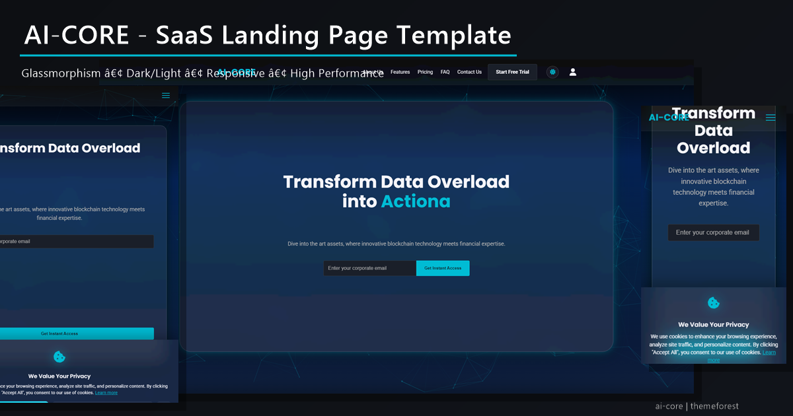

# AI-CORE | Minimalist SaaS Landing Page Template



A professional, modern SaaS landing page template featuring glassmorphism design, smooth animations, and conversion-optimized layout. Perfect for AI startups, tech companies, and SaaS businesses.

## ✨ Features

- **Modern Glassmorphism Design** - Beautiful frosted glass effect with neon borders
- **Dark/Light Mode Toggle** - Smooth animated theme switching
- **Plan Comparison Table** - Interactive feature comparison with animated checkmarks
- **Integrations Showcase** - 6 animated partner logos (Zapier, Slack, Google Sheets, etc.)
- **Fully Responsive** - Optimized for all devices and screen sizes
- **Smooth Animations** - Progressive loading, typing effects, particles.js background, and hover animations
- **Conversion Optimized** - Strategic CTA placement and form validation
- **SEO Ready** - Complete meta tags, semantic HTML, and accessibility features
- **Clean Code** - Well-organized, commented, and easy to customize
- **Modern CSS** - CSS Grid, Flexbox, and custom properties
- **Interactive Elements** - Price toggle, form validation, and micro-interactions
- **7 Complete Pages** - index, about, contact, docs, privacy, terms, 404

## 🚀 Quick Start

1. **Download** the template files
2. **Open** `index.html` in your browser
3. **Customize** colors, content, and branding
4. **Deploy** to your hosting platform

## 📁 File Structure

```
AI-CORE-Landing-Page/
├── index.html              # Main landing page
├── about.html              # About page
├── contact.html            # Contact page with form
├── docs.html               # Documentation page
├── privacy.html            # Privacy policy page
├── terms.html              # Terms of service page
├── 404.html                # 404 error page
├── assets/
│   ├── style.css           # Main stylesheet (development)
│   ├── style.min.css       # Minified stylesheet (production) ✅
│   ├── main.js             # JavaScript functionality (development)
│   ├── main.min.js         # Minified JavaScript (production) ✅
│   └── images/
│       ├── previews/       # Generated preview images
│       │   ├── ai-core-og-1200x630.png
│       │   ├── ai-core-main-preview-1200x630.png
│       │   ├── ai-core-desktop-1920x1080.png
│       │   ├── ai-core-tablet-768x1024.png
│       │   └── ai-core-mobile-375x667.png
│       ├── *.svg           # Integration partner logos
│       ├── favicon.ico     # ⚠️ ADD THIS (see IMAGES-NEEDED.md)
│       └── apple-touch-icon.png  # ⚠️ ADD THIS (see IMAGES-NEEDED.md)
├── tools/
│   ├── generate-previews.mjs      # Node.js preview generator
│   └── create-main-preview.ps1    # PowerShell collage script
├── README.md               # This file
├── INSTALLATION.md         # Detailed setup guide
├── STYLE-GUIDE.md          # Design system documentation
├── IMAGES-NEEDED.md        # Guide for missing images ⚠️
├── QA-REPORT.md            # Quality assurance report
├── CHANGELOG.md            # Version history
├── LICENSE.txt             # License information
└── package.json            # Node.js dependencies
```

## 🎨 Customization

### Colors
Edit the CSS custom properties in `assets/style.css` (or `style.min.css` after minifying):

```css
:root {
    --color-primary-accent: #00bcd4;    /* Main accent color */
    --color-dark-bg: #11141A;           /* Background color */
    --color-light-text: #F4F4F9;        /* Text color */
}
```

### Content
- **Hero Section**: Edit the typing text in `assets/main.js` (line ~400)
- **Features**: Modify the feature cards in `index.html`
- **Pricing**: Update prices and plans in the pricing section
- **Company Info**: Change logo, contact info, and branding
- **Integration Logos**: Replace SVG files in `assets/images/`

### Images
**Required** - Add these before going live (see `IMAGES-NEEDED.md`):
- `assets/images/favicon.ico` - Browser favicon (16x16, 32x32, 48x48px)
- `assets/images/apple-touch-icon.png` - iOS icon (180x180px)

**Already included**:
- Preview images in `assets/images/previews/` (auto-generated)
- Integration logos: 6 SVG files (Zapier, Slack, Google Sheets, Salesforce, HubSpot, Teams)

## 🔧 Technical Details

### Dependencies
- **Fonts**: Google Fonts (Poppins, Roboto)
- **Icons**: Font Awesome 6.0
- **Animations**: Particles.js (background effects)
- **No jQuery**: Pure vanilla JavaScript

### Production Files
All HTML pages use **minified assets** for optimal performance:
- `assets/style.min.css` - Minified CSS (used in all 7 pages)
- `assets/main.min.js` - Minified JavaScript (used in all 7 pages)

To regenerate minified files after editing:
```bash
# CSS minification
npx clean-css-cli assets/style.css -o assets/style.min.css

# JS minification
npx terser assets/main.js -o assets/main.min.js --compress --mangle
```

### Browser Support
- Chrome 60+
- Firefox 55+
- Safari 12+
- Edge 79+

### Performance
- ✅ Minified CSS and JavaScript
- ✅ Optimized preview images (5 generated)
- ✅ Minimal external dependencies
- ✅ Lazy loading and progressive enhancement
- ✅ Fast loading times

## 📱 Responsive Breakpoints

- **Desktop**: 1200px+
- **Tablet**: 768px - 1199px
- **Mobile**: 320px - 767px

## 🎯 SEO Features

- Semantic HTML structure
- Complete meta tags (Open Graph, Twitter Card)
- Preview images for social sharing
- Schema.org markup ready
- Optimized heading hierarchy

## ♿ Accessibility

- ARIA labels and roles
- Keyboard navigation support
- Screen reader compatibility
- High contrast ratios
- Focus indicators

## 📧 Form Integration

The template includes a ready-to-use contact form with:
- Email validation
- Error handling
- Success messages
- Accessibility features

To connect to your backend, update the form action in `index.html`:

```html
<form class="subscribe-form" action="your-endpoint" method="POST">
```

## 🚀 Deployment

### Static Hosting
Upload all files to your hosting provider:
- Netlify
- Vercel
- GitHub Pages
- AWS S3

### CDN Optimization
Consider using a CDN for:
- Font loading optimization
- Image compression
- Global content delivery

## 📞 Support

For support and customization requests:
- **Email**: support@yourcompany.com
- **Documentation**: [Link to full docs]
- **Updates**: Check CHANGELOG.md

## 📄 License

This template is licensed under the [ThemeForest Regular License](https://themeforest.net/licenses/standard).

## 🔄 Changelog

See [CHANGELOG.md](CHANGELOG.md) for version history and updates.

---

**Made with ❤️ for modern SaaS businesses**


